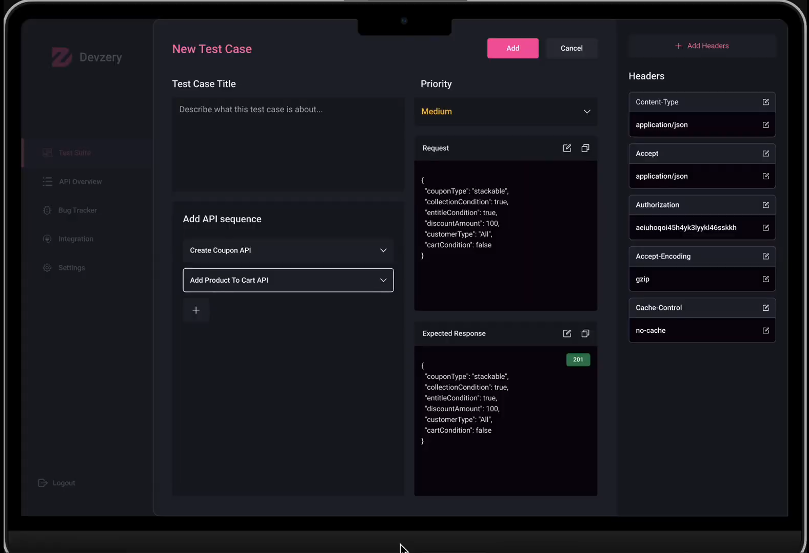

# Devzery Frontend Technical Assignment: API Chaining Dashboard

## Setup Instructions
1. Clone the repository / Open the zip file.
2. Install dependencies using ```npm i```.
3. Run the application using ```npm run dev```.
4. View the live website at ```localhost:5173/```.

## Brief explanation of your approach
1. First thing I did was to understand the givern APIs workflow, I took help of PostMan
2. After understanding that, I moved on to designing the UI using React.Js and Tailwind CSS
3. API calls are handled using Axios with each having its own custom React Hook

## Any assumptions or decisions made
- There are only the 3 specified APIs given
- Expected UI


## Completed Features
1. Headers working
2. API Sequence working
3. Get Users API working
4. Get Comments API partially working
5. Post Posts API setup
6. Expected Result for Get Users API & Get Comments API ( postId=1 )
7. Elegant Interactions with UI

## Known Issue
- Website is not responsive
- Post Posts API is setup but not working
- Get Comments API is set to work only for postId = 1
- API Chaining modal needs to be setup

## Video Demo Link
[Demo Video Link](https://drive.google.com/file/d/1ZGovi3gp35Av0CJRoJbENb_62Szk_mP9/view?usp=sharing)
